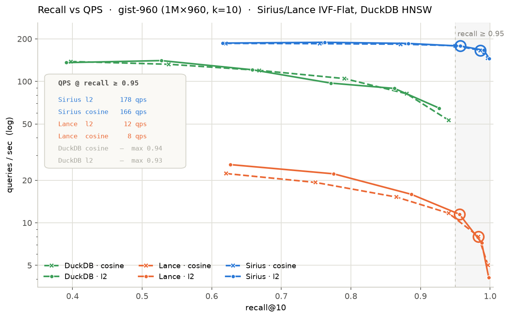

# Sirius Vector Search Evaluation

**Setup**

- GPU: Quadro RTX 6000 (Turing, 24 GB GDDR6, ~672 GB/s, ~16 TFLOP FP32)
- CPU: dual Xeon Gold 6126 (24 cores / 48 threads, ~256 GB/s aggregate DDR4)
- Dataset: GIST1M (1M × 960-dim)
- DuckDB v1.5.5

Engines: **Sirius** (GPU IVF-Flat), **Lance** (CPU IVF-Flat), **DuckDB** (CPU HNSW).

---

## ENN Latency

Single query, exact nearest neighbor.

| engine | metric |   k | min_ms | mean_ms |
|--------|--------|----:|-------:|--------:|
| sirius | l2     |  10 |   23.0 |    24.0 |
| sirius | l2     | 100 |   21.0 |    22.8 |
| sirius | cosine |  10 |   17.0 |    18.5 |
| sirius | cosine | 100 |   18.0 |    19.3 |
| lance  | l2     |  10 | 2012.0 |  2496.1 |
| lance  | l2     | 100 | 2032.0 |  2361.0 |
| lance  | cosine |  10 | 2100.0 |  2519.4 |
| lance  | cosine | 100 | 2011.0 |  2415.8 |
| duckdb | l2     |  10 |  407.0 |   461.8 |
| duckdb | l2     | 100 |  419.0 |   450.6 |
| duckdb | cosine |  10 |  425.0 |   470.8 |
| duckdb | cosine | 100 |  432.0 |   473.1 |

Note:
- On Sirius `metric=cosine` runs with GEMM, and `metric=l2` does not, so it's slower as expected.

## ENN Throughput

1000 queries, `k=10`.

| engine | metric | queries |  qps |
|--------|--------|--------:|-----:|
| sirius | l2     |    1000 | 42.5 |
| sirius | cosine |    1000 | 56.3 |
| duckdb | l2     |    1000 |  6.6 |
| duckdb | cosine |    1000 |  6.3 |

Note:
- We have not implemented batched ENN search, so the result shows that it runs sequentially.
- While DuckDB throughput is a single batched, multi-threaded LATERAL query.

## Index Creation

`n_lists=1024`.

| engine | index    | metric | build_s |
|--------|----------|--------|--------:|
| sirius | IVF-FLAT | l2     |    1.11 |
| sirius | IVF-FLAT | cosine |    1.11 |
| lance  | IVF-FLAT | l2     |   95.14 |
| lance  | IVF-FLAT | cosine |  101.42 |
| duckdb | HNSW     | l2     |  159.57 |
| duckdb | HNSW     | cosine |  233.45 |

## ANN Latency

Single query, `n_lists=1024`, `n_probes=32`.

| engine | index    | metric |   k | min_ms | mean_ms |
|--------|----------|--------|----:|-------:|--------:|
| sirius | IVF-FLAT | l2     |  10 |    5.0 |     5.1 |
| sirius | IVF-FLAT | l2     | 100 |    5.0 |     6.8 |
| sirius | IVF-FLAT | cosine |  10 |    5.0 |     6.7 |
| sirius | IVF-FLAT | cosine | 100 |    5.0 |     6.7 |
| lance  | IVF-FLAT | l2     |  10 |   41.0 |    43.3 |
| lance  | IVF-FLAT | l2     | 100 |   42.0 |    55.4 |
| lance  | IVF-FLAT | cosine |  10 |   43.0 |    55.9 |
| lance  | IVF-FLAT | cosine | 100 |   34.0 |    49.6 |
| duckdb | HNSW     | l2     |  10 |    7.0 |     8.1 |
| duckdb | HNSW     | l2     | 100 |    8.0 |     8.9 |
| duckdb | HNSW     | cosine |  10 |   11.0 |    12.1 |
| duckdb | HNSW     | cosine | 100 |   11.0 |    12.0 |

Note:
- We have not implemented batched ANN search, so the result shows that it runs sequentially.

## ANN Recall / QPS Tradeoff

`k=10`, `nq=1000`, `n_lists=1024` (IVF-Flat), `M=16 / ef_construction=128` (HNSW).

| engine | index    | metric | probe/ef | scan% | mean_ms | recall |   qps |
|--------|----------|--------|---------:|------:|--------:|-------:|------:|
| sirius | IVF-FLAT | l2     |        8 | 0.78% |     5.4 | 0.6158 | 186.7 |
| sirius | IVF-FLAT | l2     |       16 | 1.56% |     5.3 | 0.7623 | 189.1 |
| sirius | IVF-FLAT | l2     |       32 | 3.12% |     5.4 | 0.8823 | 185.6 |
| sirius | IVF-FLAT | l2     |       64 | 6.25% |     5.6 | 0.9574 | 177.9 |
| sirius | IVF-FLAT | l2     |      128 |12.50% |     6.0 | 0.9907 | 166.4 |
| sirius | IVF-FLAT | l2     |      256 |25.00% |     6.9 | 0.9989 | 144.9 |
| sirius | IVF-FLAT | cosine |        8 | 0.78% |     5.4 | 0.6202 | 185.8 |
| sirius | IVF-FLAT | cosine |       16 | 1.56% |     5.4 | 0.7552 | 184.9 |
| sirius | IVF-FLAT | cosine |       32 | 3.12% |     5.4 | 0.8715 | 183.5 |
| sirius | IVF-FLAT | cosine |       64 | 6.25% |     5.6 | 0.9499 | 178.8 |
| sirius | IVF-FLAT | cosine |      128 |12.50% |     6.0 | 0.9862 | 165.9 |
| sirius | IVF-FLAT | cosine |      256 |25.00% |     6.9 | 0.9963 | 145.6 |
| lance  | IVF-FLAT | l2     |        8 | 0.78% |    38.7 | 0.6267 |  25.8 |
| lance  | IVF-FLAT | l2     |       16 | 1.56% |    45.0 | 0.7753 |  22.2 |
| lance  | IVF-FLAT | l2     |       32 | 3.12% |    62.7 | 0.8868 |  15.9 |
| lance  | IVF-FLAT | l2     |       64 | 6.25% |    87.0 | 0.9558 |  11.5 |
| lance  | IVF-FLAT | l2     |      128 |12.50% |   138.5 | 0.9879 |   7.2 |
| lance  | IVF-FLAT | l2     |      256 |25.00% |   241.8 | 0.9980 |   4.1 |
| lance  | IVF-FLAT | cosine |        8 | 0.78% |    44.8 | 0.6207 |  22.3 |
| lance  | IVF-FLAT | cosine |       16 | 1.56% |    51.8 | 0.7490 |  19.3 |
| lance  | IVF-FLAT | cosine |       32 | 3.12% |    65.7 | 0.8655 |  15.2 |
| lance  | IVF-FLAT | cosine |       64 | 6.25% |    85.5 | 0.9403 |  11.7 |
| lance  | IVF-FLAT | cosine |      128 |12.50% |   124.4 | 0.9833 |   8.0 |
| lance  | IVF-FLAT | cosine |      256 |25.00% |   201.0 | 0.9969 |   5.0 |
| duckdb | HNSW     | l2     |       10 |     - |     7.4 | 0.3910 | 135.8 |
| duckdb | HNSW     | l2     |       20 |     - |     7.1 | 0.5276 | 140.4 |
| duckdb | HNSW     | l2     |       40 |     - |     8.3 | 0.6584 | 120.9 |
| duckdb | HNSW     | l2     |       80 |     - |    10.3 | 0.7710 |  97.3 |
| duckdb | HNSW     | l2     |      160 |     - |    11.2 | 0.8625 |  89.2 |
| duckdb | HNSW     | l2     |      320 |     - |    15.5 | 0.9269 |  64.7 |
| duckdb | HNSW     | cosine |       10 |     - |     7.2 | 0.3974 | 138.3 |
| duckdb | HNSW     | cosine |       20 |     - |     7.6 | 0.5384 | 132.2 |
| duckdb | HNSW     | cosine |       40 |     - |     8.4 | 0.6684 | 119.7 |
| duckdb | HNSW     | cosine |       80 |     - |     9.6 | 0.7908 | 104.7 |
| duckdb | HNSW     | cosine |      160 |     - |    12.2 | 0.8800 |  81.8 |
| duckdb | HNSW     | cosine |      320 |     - |    18.8 | 0.9405 |  53.1 |

**QPS @ recall ≥ 0.95**

| engine | metric | probe/ef | recall |   qps |
|--------|--------|---------:|-------:|------:|
| sirius | l2     |  np=64   | 0.9574 | 177.9 |
| sirius | cosine |  np=128  | 0.9862 | 165.9 |
| lance  | l2     |  np=64   | 0.9558 |  11.5 |
| lance  | cosine |  np=128  | 0.9833 |   8.0 |
| duckdb | l2     |  —       |    —   |   —   |
| duckdb | cosine |  —       |    —   |   —   |

Note on DuckDB:
- GIST at 960 dimensions is known to be hard for graph indexes, so this is expected for DuckDB HNSW.

Note on Lance:
- Note: Lance doesn't have cosine metric, so every Lance cosine run uses a unit-normalized dataset with an L2 index and a unit-normalized query.
- Lance is accessed through the DuckDB `lance_vector_search` extension, one call per query. A native Lance (Python) run on the same index was measured about 1.7x higher QPS, so the extension path is somewhat slower.
- Even against native Lance, Sirius still leads by about 9x at recall >= 0.95 (Sirius ~178 qps vs native Lance ~20 qps at n_probes=64).

## Recall-QPS curve

