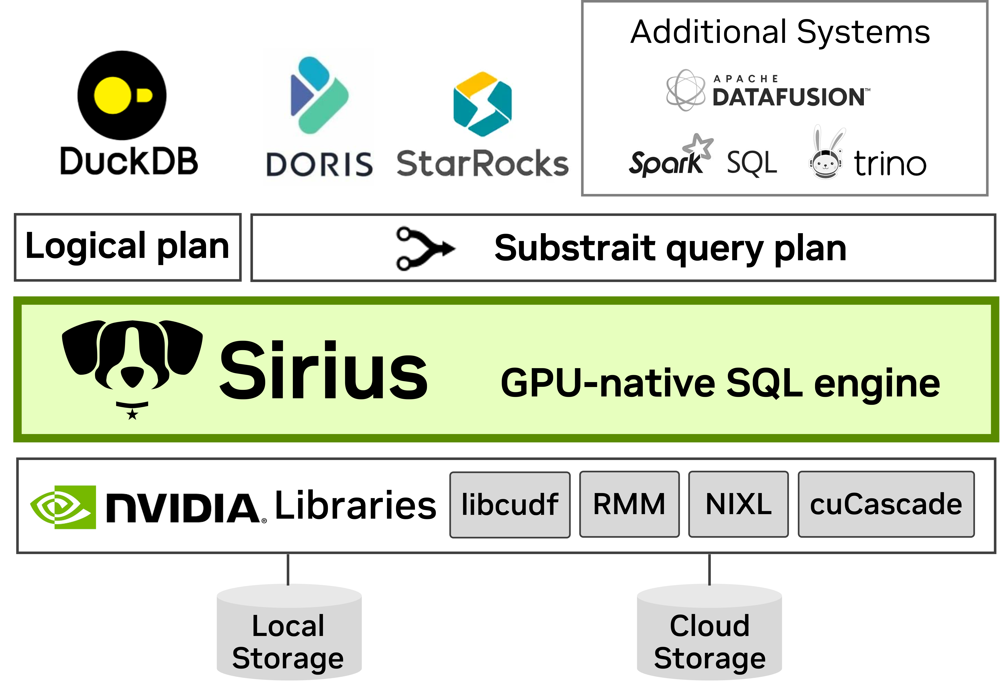

<!--  -->
<p align="center">
  
  <br/>
  <a href="https://join.slack.com/t/sirius-db/shared_invite/zt-33tuwt1sk-aa2dk0EU_dNjklSjIGW3vg">
    
  </a>
</p>

Sirius is a GPU-native SQL engine. It plugs into existing databases such as DuckDB via the standard Substrait query format, requiring no query rewrites or major system changes. Sirius currently supports DuckDB and Doris (coming soon), other systems marked with * are on our roadmap. Built on NVIDIA CUDA-X libraries including cuDF and RAPIDS Memory Manager (RMM), Sirius delivers high-performance GPU-accelerated analytics.

<!--  -->
<p align="center">
  
</p>

## Performance
Running TPC-H on 1TB data, Sirius accelerates DuckDB by 5x on DGX Station (GB300).


## Supported OS/GPU/CUDA
- Ubuntu >= 22.04
- NVIDIA Volta™ or higher with compute capability 7.0+
- CUDA >= 13.0 (requires NVIDIA driver >= 570)
- We recommend building Sirius with at least **16 vCPUs** to ensure faster compilation.

### Installing Dependencies

- Git (to clone the repo)
- Pixi (install instructions [here](https://pixi.sh/latest/installation/))

## Building and Running Sirius

Sirius provides two execution paths. See each page for how to build, run, and test:

- **[`gpu_execution`](gpu_execution.md) (Recommended)** — Out-of-core execution with tiered memory management (GPU/host/disk), automatic data partitioning, and spilling. Works with **Parquet** data format.
- **[`gpu_processing`](gpu_processing.md)** — In-memory execution where the dataset must fit in GPU memory. Works with DuckDB's native storage format.

## Logging
Sirius uses [spdlog](https://github.com/gabime/spdlog) for logging messages during query execution. Default log directory is `log` (relative to the current working directory) and default log level is `info`.

Log directory and level can be initialized via environment variables before loading the extension:
```bash
export SIRIUS_LOG_DIR=/path/to/logs
export SIRIUS_LOG_LEVEL=trace
```

Both can also be configured at runtime via DuckDB's `SET` command:
```sql
SET sirius_log_dir = '/path/to/logs';
SET sirius_log_level = 'trace';
SET sirius_log_flush_seconds = 1;
```

## Limitations

Sirius is under active development. Notable current limitations include:

- **Data Type Coverage:** Sirius currently supports commonly used data types including `INTEGER`, `BIGINT`, `FLOAT`, `DOUBLE`, `VARCHAR`, `DATE`, `TIMESTAMP`, and `DECIMAL`. We are actively working on supporting additional data types—such as nested types.
- **Operator Coverage:** At present, Sirius supports `FILTER`, `PROJECTION`, `JOIN` (Hash/Nested Loop/Delim), `GROUP-BY`, `ORDER-BY`, `AGGREGATION`, `TOP-N`, `LIMIT`, and `CTE`. We are working on adding more advanced operators such as `WINDOW` functions and `ASOF JOIN`, etc.

For a full list of current limitations and ongoing work, please refer to our [GitHub issues page](https://github.com/sirius-db/sirius/issues). **If these issues are encountered when running Sirius, Sirius will gracefully fallback to DuckDB query execution on CPUs.**

## Contributors and Partners

<p align="center">
  <a href="https://www.nvidia.com/"></a>
  &nbsp;&nbsp;&nbsp;&nbsp;&nbsp;&nbsp;&nbsp;&nbsp;
  <a href="https://www.wisc.edu/"></a>
</p>
<p align="center">
  <a href="https://duckdblabs.com/"></a>
  &nbsp;&nbsp;&nbsp;&nbsp;&nbsp;&nbsp;&nbsp;&nbsp;
  <a href="https://www.vastdata.com/"></a>
</p>

## Future Roadmap
Sirius is still under major development and we are working on adding more features to Sirius, such as disk spilling, multi-GPUs, multi-node, more operators, data types, accelerating more engines, and many more.

Sirius always welcomes new contributors! If you are interested, check our [website](https://www.sirius-db.com/), reach out to our [email](siriusdb@cs.wisc.edu), or join our [slack channel](https://join.slack.com/t/sirius-db/shared_invite/zt-33tuwt1sk-aa2dk0EU_dNjklSjIGW3vg).

**Let's kickstart the GPU eras for Data Analytics!**
