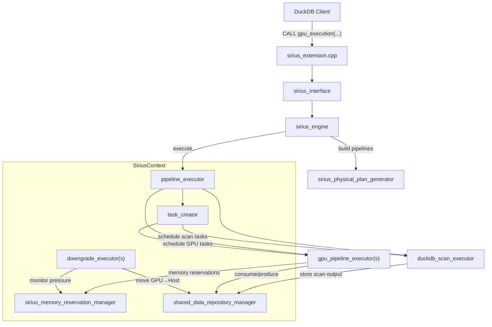

# Architecture Overview

This document describes the high-level architecture of Super Sirius, including component ownership, thread model, and execution lifecycle.

## Component Diagram



## Ownership Hierarchy

`SiriusContext` (`src/include/sirius_context.hpp`) is a `ClientContextState` subclass that owns the lifetime of all Sirius subsystems within a DuckDB connection:

```
SiriusContext
├── sirius_config                       # Configuration (thread counts, memory sizes, operator params)
├── sirius_memory_reservation_manager   # GPU/Host/Disk memory management via cuCascade
├── small_pinned_host_memory_resource   # Pinned host memory allocator
├── shared_data_repository_manager      # Central registry of all data repositories
├── pipeline_executor                   # Top-level executor (owns GPU + scan executors)
├── downgrade_executor[]                # Per-memory-space monitors for GPU→Host spilling
├── task_creator                        # Creates scan and GPU tasks based on data availability
└── query                               # Current query context (pipeline hashmap)
```

Key lifecycle methods on `SiriusContext`:
- `initialize()` — initializes all subsystems with config
- `terminate()` — releases all resources
- `QueryBegin()` / `QueryEnd()` — DuckDB query lifecycle hooks
- `create_query()` — creates a new query with pipeline metadata

## Thread Model

Super Sirius uses multiple dedicated thread pools, each with a specific role:

```
┌─────────────────────────────────────────────────────────────────┐
│  DuckDB Query Thread (main)                                     │
│  - Parses SQL, generates logical plan                           │
│  - Calls sirius_interface → sirius_engine                       │
│  - Builds pipelines (single-threaded)                           │
│  - Calls pipeline_executor.start_query()                        │
│  - Blocks on future until query completes                       │
└─────────────────────────────────────────────────────────────────┘

┌─────────────────────────────────────────────────────────────────┐
│  Pipeline Executor Management Thread                            │
│  - Runs management_eventloop()                                  │
│  - Listens on task_request_channel for GPU executor requests    │
│  - Dequeues pipeline tasks and routes to GPU executors           │
└─────────────────────────────────────────────────────────────────┘

┌─────────────────────────────────────────────────────────────────┐
│  GPU Pipeline Executor (per GPU device)                         │
│  - Manager thread: acquires kiosk ticket → requests task →      │
│    reserves memory → dispatches to worker thread pool            │
│  - Worker threads (default: 4): execute GPU pipeline tasks      │
│    on dedicated CUDA streams                                    │
└─────────────────────────────────────────────────────────────────┘

┌─────────────────────────────────────────────────────────────────┐
│  Task Creator Thread Pool (default: 2 threads)                  │
│  - Manager loop: pops from task_creation_queue                  │
│  - Follows hint chain to find ready operators                   │
│  - Creates scan or GPU pipeline tasks                           │
└─────────────────────────────────────────────────────────────────┘

┌─────────────────────────────────────────────────────────────────┐
│  Scan Executor                                                  │
│  - Manager thread: pops scan tasks, acquires kiosk tickets      │
│  - Worker threads (default: 4): execute DuckDB/Parquet scans    │
│  - CUDA stream pool for async Host→Device transfers             │
└─────────────────────────────────────────────────────────────────┘

┌─────────────────────────────────────────────────────────────────┐
│  Downgrade Executor(s) (per memory space)                       │
│  - Monitor thread: polls memory pressure every ~10ms            │
│  - Manager thread: dispatches downgrade tasks                   │
│  - Worker threads (default: 4): move data GPU→Host              │
└─────────────────────────────────────────────────────────────────┘
```

## Execution Lifecycle

A query through Super Sirius follows these steps:

1. **Parse & Optimize** — DuckDB parses the SQL string and produces an optimized logical plan
2. **Physical Plan Generation** — `sirius_physical_plan_generator::create_plan()` converts the DuckDB logical plan into a Sirius physical operator tree
3. **Engine Initialization** — `sirius_engine::initialize()` builds the pipeline graph:
   - Constructs `sirius_meta_pipeline` from the physical plan via `build()` + `ready()`
   - Splits operators (TABLE_SCAN, joins, aggregates, sorts) into multiple pipelines
   - Injects PARTITION, CONCAT, MERGE operators at pipeline boundaries
   - Wires data repositories between pipelines with barrier types
4. **Query Preparation** — `pipeline_executor::prepare_for_query()` drains leftover state, prepares scan cache, queues initial scan operators
5. **Query Start** — `pipeline_executor::start_query()` creates a `completion_handler`, distributes it to all sub-executors, and schedules initial scan tasks
6. **Scan Phase** — Scan executor pulls data from storage (DuckDB tables or Parquet files), converts to GPU-compatible format, and publishes to data repositories
7. **Pipeline Execution** — GPU executor threads pull tasks from the queue, acquire memory reservations, and call `execute()` on every operator in the pipeline (source through sink) on CUDA streams, then call the sink's `sink()` to push results downstream
8. **Task Creation** — After each task completes, the task creator is notified to schedule downstream consumers based on data availability in ports
9. **Memory Management** — Downgrade executors monitor GPU memory pressure and spill data to host memory when thresholds are exceeded
10. **Completion** — When the final `RESULT_COLLECTOR` pipeline finishes, `completion_handler::mark_completed()` signals the future
11. **Result Extraction** — The main thread extracts the `MaterializedQueryResult` from the result collector and returns it to DuckDB

## Key Source Files

| File | Role |
|------|------|
| `src/include/sirius_context.hpp` | Ownership hierarchy, subsystem lifecycle |
| `src/sirius_extension.cpp` | Extension registration, table functions, config |
| `src/sirius_interface.cpp` | DuckDB-facing API, query lifecycle |
| `src/sirius_engine.cpp` | Pipeline construction, execution orchestration |
| `src/planner/sirius_physical_plan_generator.cpp` | Logical-to-physical plan translation |
| `src/include/pipeline/pipeline_executor.hpp` | Top-level executor |
| `src/include/pipeline/gpu_pipeline_executor.hpp` | Per-GPU task executor |
| `src/include/creator/task_creator.hpp` | Task creation and scheduling |
| `src/include/op/scan/duckdb_scan_executor.hpp` | Scan task executor |
| `src/include/downgrade/downgrade_executor.hpp` | Memory spilling |
| `src/include/memory/sirius_memory_reservation_manager.hpp` | Memory management |
