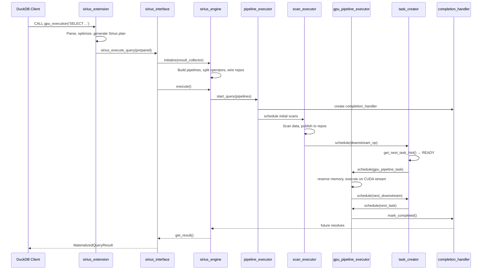

# Execution Flow

This document traces a Super Sirius query end-to-end, from SQL string to `QueryResult`, with file and line references.

## Entry Point

The user invokes Super Sirius via DuckDB:

```sql
CALL gpu_execution('SELECT * FROM lineitem WHERE l_quantity > 25');
```

## Step 1: Extension Table Function Bind

**File:** `src/sirius_extension.cpp`

DuckDB calls `GPUExecutionBind()` which:

1. Extracts the SQL string from the function arguments
2. Parses and optimizes the query through DuckDB's standard pipeline (parser → binder → optimizer)
3. Generates the Sirius physical plan via `sirius_physical_plan_generator::create_plan()`
4. Wraps both the DuckDB prepared statement and the Sirius plan into `sirius_prepared_statement_data`
5. Returns `SiriusTableFunctionData` containing the prepared statement

## Step 2: Extension Table Function Execute

**File:** `src/sirius_extension.cpp`

DuckDB calls `GPUExecutionFunction()` which:

1. Creates a `sirius_interface` for the current connection
2. Calls `sirius_iface->sirius_execute_query(prepared_statement)` to run the query
3. On failure (if fallback enabled), gracefully falls back to DuckDB CPU execution

## Step 3: Query Lifecycle Setup

**File:** `src/sirius_interface.cpp`

`sirius_execute_query()` delegates to:

1. `sirius_pending_statement_or_prepared_statement()`:
   - Calls `begin_query_internal()` to set up the active query context
   - Calls `sirius_pending_statement_internal()` which:
     - Creates a `sirius_engine(context, sirius_iface)`
     - Creates a `sirius_physical_materialized_collector` as the result sink
     - Calls `engine.initialize(collector)` to build pipelines (see Step 4)
     - Returns a `PendingQueryResult`

2. `sirius_execute_pending_query_result(pending)`:
   - Calls `engine.execute()` to run the GPU pipelines (see Step 5)
   - On completion, calls `fetch_result_internal()` which extracts the materialized result

## Step 4: Pipeline Construction

**File:** `src/sirius_engine.cpp` — `initialize_internal()`

This is the core pipeline-building step (single-threaded, runs on the query thread):

### 4a. Build Meta-Pipelines

```
sirius_meta_pipeline root(engine, state, result_collector);
root.build(*sirius_physical_plan);  // Recursively builds pipeline graph
root.ready();                       // Reverses operator lists, marks pipelines ready
```

Each operator's `build_pipelines()` method is called recursively:
- **Streaming operators** (FILTER, PROJECTION): added as intermediate operators to the current pipeline
- **Blocking operators** (HASH_JOIN, ORDER_BY): become sinks, create child meta-pipelines for their build inputs
- **Source operators** (scans): set as pipeline source

### 4b. Operator-Specific Pipeline Splitting

After meta-pipeline construction, `initialize_internal()` applies Sirius-specific transformations:

- **TABLE_SCAN** → converted to `DUCKDB_SCAN` or `PARQUET_SCAN`
- **HASH_JOIN** → inserts `PARTITION + CONCAT` on both probe and build sides
- **HASH_GROUP_BY** → inserts `PARTITION + MERGE_GROUP_BY`
- **UNGROUPED_AGGREGATE** → inserts `PARTITION + MERGE_AGGREGATE`
- **ORDER_BY** → creates 4-phase sort: `ORDER → SORT_SAMPLE → SORT_PARTITION → MERGE_SORT`
- **TOP_N** → adds `MERGE_TOP_N`
- **DELIM_JOIN** → complex splitting with partition_join and distinct branches

### 4c. Data Repository Wiring

`insert_repository()` creates `shared_data_repository` instances between pipelines and configures ports with barrier types:
- **FULL barrier**: downstream waits for upstream to complete (e.g., hash join build side)
- **PARTIAL barrier**: downstream can consume data incrementally
- **PIPELINE barrier**: streaming, no synchronization needed

### 4d. Pipeline Finalization

- Sinks are pushed into operator arrays
- Source references are set
- Parent-child dependencies are established
- Sibling partition operators are linked for hash joins
- The finalized pipeline list is stored in `new_scheduled`

## Step 5: Execution

**File:** `src/sirius_engine.cpp` — `execute()`

1. Creates a `query` object from `new_scheduled` pipelines with a pipeline hashmap
2. Calls `pipeline_executor.start_query(query)` which:
   - Creates a `completion_handler` with promise/future
   - Distributes the handler to all sub-executors
   - Schedules initial scan tasks from the priority queue
   - Returns the future

3. The main thread blocks on `future.get()` until the query completes

## Step 6: Scan Execution

**File:** `src/op/scan/duckdb_scan_executor.cpp`

The scan executor's manager loop:

1. Acquires a kiosk ticket (blocks until a worker thread is free)
2. Pops a scan task from the queue
3. For parquet scans: acquires host memory reservation
4. Dispatches to the worker thread pool:
   - Executes the scan task (DuckDB table function or Parquet byte reads)
   - Applies caching logic (CACHE mode: compute + save; PRELOAD mode: load from cache)
   - Publishes output data batches to the data repository
   - Schedules downstream consumer operators via `task_creator->schedule()`

## Step 7: GPU Pipeline Execution

**File:** `src/pipeline/gpu_pipeline_executor.cpp`

The GPU executor's manager loop:

1. **Acquire kiosk ticket** — blocks until a GPU worker is free
2. **Send task request** — signals the pipeline executor that it can accept work
3. **Pop task** — blocks until a `gpu_pipeline_task` is available
4. **Reserve memory** — acquires GPU memory reservation from `memory_space`
5. **Dispatch to worker thread** — on the thread pool with a CUDA stream:
   - Lock input batches and convert to GPU if needed (`lock_or_prepare_batch`)
   - `compute_task()`: iterate **all** operators in the pipeline (source through sink), calling `execute()` on each
   - `publish_output()`: call the sink's `sink()` method to push results to downstream ports
   - On OOM: catch `oom_reschedule_exception`, retry up to 10 times with 5ms backoff
   - On success: check if query is complete (RESULT_COLLECTOR sink + pipeline finished)
   - If not complete: schedule downstream consumers via `task_creator->schedule()`
   - If complete: `completion_handler->mark_completed()`

## Step 8: Task Creation Cycle

**File:** `src/creator/task_creator.cpp`

After a GPU task completes and schedules downstream operators:

1. The task creator receives `schedule(operator*)` calls
2. Its manager loop calls `get_operator_for_next_task(operator)` which:
   - Calls `operator->get_next_task_hint()` to check data availability
   - If `READY`: the operator has data — create a task
   - If `WAITING_FOR_INPUT_DATA`: recursively follow the producer chain
3. Creates the appropriate task type (scan or GPU pipeline)
4. Dispatches to the correct executor

## Step 9: Result Extraction

**File:** `src/sirius_interface.cpp`

After the future resolves:

1. `fetch_result_internal()` calls `engine.get_result()`
2. The result collector (`sirius_physical_materialized_collector`) returns its `ColumnDataCollection`
3. The materialized result is wrapped in a `MaterializedQueryResult` and returned to DuckDB
4. `cleanup_internal()` resets the progress bar and calls `end_query_internal()`

## Error Handling

If any task throws an exception during execution:

1. The GPU executor catches it and calls `completion_handler->report_error(exception)`
2. `drain_after_error()` is called on the pipeline executor which:
   - Stops the task creator threads
   - Drains the task queue
   - Calls `drain_and_wait()` on scan and GPU executors
   - Restarts the task creator for the next query
3. The error propagates through the future to the main thread

## Sequence Diagram


