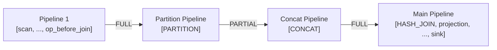
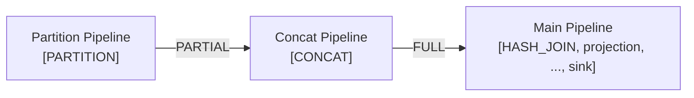
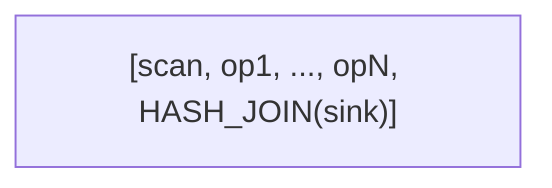
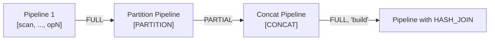
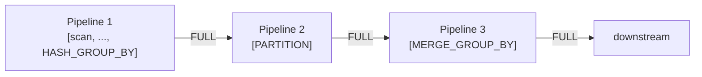
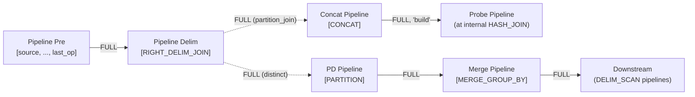
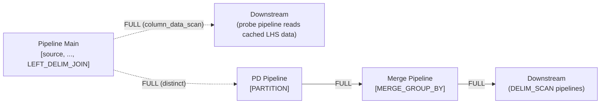

# Physical Plan Generation

This document covers three interconnected topics: translating DuckDB logical plans to Sirius physical operators, constructing pipelines, and splitting pipelines for distributed GPU execution.

## Part 1: Plan Generator

**File:** `src/planner/sirius_physical_plan_generator.cpp`

The `sirius_physical_plan_generator::create_plan()` method is the entry point. It:

1. Resolves types for each logical operator
2. Resolves column references via `ColumnBindingResolver`
3. Dispatches to operator-specific `create_plan()` overloads via a switch on `op.type`
4. Returns a `sirius_physical_operator` tree

### Operator Mapping Table

| DuckDB Logical Operator | Sirius Physical Operator | Plan Builder File |
|------------------------|--------------------------|-------------------|
| `LOGICAL_GET` | `TABLE_SCAN` | `src/planner/sirius_plan_get.cpp` |
| `LOGICAL_PROJECTION` | `PROJECTION` | `src/planner/sirius_plan_projection.cpp` |
| `LOGICAL_FILTER` | `FILTER` | `src/planner/sirius_plan_filter.cpp` |
| `LOGICAL_AGGREGATE_AND_GROUP_BY` | `HASH_GROUP_BY` / `UNGROUPED_AGGREGATE` | `src/planner/sirius_plan_aggregate.cpp` |
| `LOGICAL_COMPARISON_JOIN` | `HASH_JOIN` / `NESTED_LOOP_JOIN` | `src/planner/sirius_plan_comparison_join.cpp` |
| `LOGICAL_DELIM_JOIN` | `LEFT_DELIM_JOIN` / `RIGHT_DELIM_JOIN` | `src/planner/sirius_plan_comparison_join.cpp` |
| `LOGICAL_ORDER_BY` | `ORDER_BY` | `src/planner/sirius_plan_order.cpp` |
| `LOGICAL_TOP_N` | `TOP_N` | `src/planner/sirius_plan_top_n.cpp` |
| `LOGICAL_LIMIT` | `STREAMING_LIMIT` | `src/planner/sirius_plan_limit.cpp` |
| `LOGICAL_CHUNK_GET` | `COLUMN_DATA_SCAN` | `src/planner/sirius_plan_column_data_get.cpp` |
| `LOGICAL_DELIM_GET` | `DELIM_SCAN` | `src/planner/sirius_plan_delim_get.cpp` |
| `LOGICAL_EXPRESSION_GET` | `COLUMN_DATA_SCAN` | `src/planner/sirius_plan_expression_get.cpp` |
| `LOGICAL_MATERIALIZED_CTE` | `CTE` | `src/planner/sirius_plan_cte.cpp` |
| `LOGICAL_CTE_REF` | `CTE_SCAN` | `src/planner/sirius_plan_recursive_cte.cpp` |
| `LOGICAL_DUMMY_SCAN` | `DUMMY_SCAN` | `src/planner/sirius_plan_dummy_scan.cpp` |
| `LOGICAL_EMPTY_RESULT` | `EMPTY_RESULT` | `src/planner/sirius_plan_empty_result.cpp` |

**Unsupported operators** (throw `NotImplementedException`, triggering CPU fallback):
`LOGICAL_WINDOW`, `LOGICAL_UNNEST`, `LOGICAL_SAMPLE`, `LOGICAL_ANY_JOIN`, `LOGICAL_ASOF_JOIN`, `LOGICAL_CROSS_PRODUCT`, `LOGICAL_RECURSIVE_CTE`

### Join Planning

**File:** `src/planner/sirius_plan_comparison_join.cpp`

The `plan_comparison_join()` method selects the join implementation:

1. **Hash Join** — chosen when at least one equality condition exists. Checks `are_conditions_supported()` for mixed joins (equality + inequality on disjoint columns). Created with `max_build_hash_table_bytes` limit.
2. **Nested Loop Join** — fallback for pure inequality joins where `PhysicalNestedLoopJoin::IsSupported()` returns true.

Left side = probe (streamed), right side = build (materialized).

### Aggregate Planning

**File:** `src/planner/sirius_plan_aggregate.cpp`

- **Ungrouped aggregate** — when no GROUP BY columns exist
- **Grouped aggregate** — hash-based GROUP BY using cuDF's `groupby()` API
- **AVG decomposition** — AVG is split into SUM + COUNT_VALID (cuDF doesn't support AVG directly)
- **COUNT(DISTINCT)** — implemented via `COLLECT_SET` aggregation, then counting unique rows
- **HUGEINT downcast** — HUGEINT types are downcast to BIGINT (cuDF doesn't support int128)

### Filter Pushdown

**File:** `src/planner/sirius_plan_get.cpp`

When a `LogicalGet` has table filters and the table function supports `FILTER_PUSHDOWN`:
- Filters are pushed into the `sirius_physical_table_scan` operator
- Filter columns are added to `projection_ids` even if not in the output
- A separate `sirius_physical_filter` is created for column types not supported by the table function

### Projection Elision

**File:** `src/planner/sirius_plan_projection.cpp`

Projections are omitted when columns are already in the correct order (passthrough case like `PROJECTION(#0, #1, #2, ...)`).

## Part 2: Pipeline Structure

### `sirius_pipeline`

**File:** `src/include/pipeline/sirius_pipeline.hpp`

A pipeline is an ordered list of operators:

| Field | Type | Purpose |
|-------|------|---------|
| `source` | `optional_ptr<sirius_physical_operator>` | Alias for the **first** operator in `operators` |
| `operators` | `vector<reference<sirius_physical_operator>>` | **All** operators in execution order, including source and sink |
| `sink` | `optional_ptr<sirius_physical_operator>` | Alias for the **last** operator in `operators` |
| `dependencies` | `vector<shared_ptr<sirius_pipeline>>` | Pipelines that must finish before this one starts |
| `parents` | `vector<weak_ptr<sirius_pipeline>>` | Pipelines that depend on this one finishing |
| `tasks_created` | `atomic<size_t>` | Number of tasks created for this pipeline |
| `tasks_completed` | `atomic<size_t>` | Number of tasks that have finished |
| `pipeline_finished` | `atomic<bool>` | Set when all tasks are done and source is drained |

> **Important:** Unlike DuckDB's pipeline model where `source` and `sink` are separate from the `operators` list, Sirius finalizes pipelines at the end of `initialize_internal()` (line ~1133) by pushing the sink into `operators` and setting `source = &operators[0]`. After finalization, `operators` contains **every** operator from source to sink inclusive. `get_operators()` returns this full list, which `compute_task()` iterates over to call each operator's `execute()`.

Key methods:
- `mark_task_created()` — increments `tasks_created`, starts NVTX range on first task
- `mark_task_completed()` — increments `tasks_completed`, calls `update_pipeline_status()`
- `update_pipeline_status()` — checks source-dependent completion logic:
  - DUCKDB_SCAN: finished when `exhausted` flag is set
  - PARQUET_SCAN: finished when `has_more_partitions` is false and `tasks_created == tasks_completed`
  - Others: finished when upstream done, ports empty, and all tasks completed
- `is_ready()` — marks pipeline ready and reverses operators to execution order
- `register_new_batch_index()` / `update_batch_index()` — batch ordering for order-preserving execution

### `sirius_meta_pipeline`

**File:** `src/include/pipeline/sirius_meta_pipeline.hpp`

Groups pipelines that share the same sink operator. Manages inter-pipeline dependencies and build order.

Key methods:
- `build(operator)` — delegates to `operator.build_pipelines()` on the base pipeline
- `ready()` — calls `is_ready()` on all pipelines recursively
- `create_child_meta_pipeline(current, op)` — creates a child for blocking operator build inputs
- `create_pipeline()` — adds a new pipeline sharing the same sink
- `add_dependencies_from(dependent, start, including)` — collects pipelines after a point as dependencies

Build order rules:
1. Join build side before probe side
2. Child meta-pipelines after all pipelines for the current operator
3. Child pipeline auto-depends on current streaming pipeline and all siblings

### `sirius_pipeline_build_state`

**File:** `src/include/pipeline/sirius_pipeline_build_state.hpp`

Provides controlled write access to pipeline internals during construction:
- `set_pipeline_source()` / `set_pipeline_sink()` — assign source/sink operators
- `add_pipeline_operator()` — add intermediate operator
- `create_child_pipeline()` — delegate to engine
- `delim_join_dependencies` — maps scan operators to their delim join producer pipelines
- `cte_dependencies` — maps CTE scan operators to their materialization pipelines

### `build_pipelines()` Patterns

Each operator implements `build_pipelines(current, meta_pipeline)`. Note that during this phase, operators are added in DuckDB's style (separate source/operators/sink). The finalization step at the end of `initialize_internal()` then merges them into a single `operators` list (see [Pipeline Finalization](#pipeline-finalization) below).

**Streaming operators** (FILTER, PROJECTION, LIMIT):
```
state.add_pipeline_operator(current, *this);
children[0]->build_pipelines(current, meta_pipeline);
```

**Blocking operators** (HASH_JOIN):
```
state.add_pipeline_operator(current, *this);
// Create child meta-pipeline for build side
auto& child = meta_pipeline.create_child_meta_pipeline(current, *this);
child.build(*children[1]);  // Build RHS first
children[0]->build_pipelines(current, meta_pipeline);  // Probe in current
```

**Source operators** (scans):
```
state.set_pipeline_source(current, *this);
```

**CTE operator**:
```
auto& child = meta_pipeline.create_child_meta_pipeline(current, *this);
child.build(*children[0]);  // Materialization pipeline
// Register CTE scan dependencies
for (auto& scan : cte_scans) {
    state.cte_dependencies[scan] = child.get_base_pipeline();
}
children[1]->build_pipelines(current, meta_pipeline);  // Reference side
```

### Pipeline Finalization

During `finalize_pipeline_structure()` in `sirius_pipeline_converter` (`src/pipeline/sirius_pipeline_converter.cpp`), after all pipeline splitting is done, each pipeline is finalized:

```cpp
// Finalize pipeline structure: push sink into operators, set source
for (auto& pipeline : new_scheduled) {
    pipeline->operators.push_back(*pipeline->sink);
    pipeline->source = &pipeline->operators[0].get();
}
```

After this step:
- `operators` contains **all** operators from source to sink inclusive
- `source` points to `operators[0]` (the first operator)
- `sink` points to the last operator (which was just pushed in)
- `get_operators()` returns this full list

## Part 3: Pipeline Splitting Rules

After meta-pipeline construction, `sirius_pipeline_converter::convert()` applies Sirius-specific pipeline splitting. This class organizes the work into focused phases:

1. `schedule_and_copy_pipelines()` — walk meta-pipeline tree, schedule and copy
2. `split_pipelines()` — dispatches to per-operator splitting helpers (`split_table_scan_source`, `split_intermediate_joins`, `split_join_sink`, `split_group_aggregate_sink`, `split_order_by_sink`, `split_top_n_sink`, `split_delim_join_sink`)
3. `wire_data_repositories()` — connect operator ports to data repositories
4. `setup_pipeline_parents()` — assign parent/child pipeline relationships
5. `finalize_pipeline_structure()` — source/sink semantic shift (see [Pipeline Finalization](#pipeline-finalization))
6. `link_join_partition_siblings()` — link PARTITION/JOIN/CONCAT sibling chains
7. `log_pipeline_debug_info()` — structured debug logging

`sirius_engine::initialize_internal()` is now a ~35-line orchestrator calling `sirius_pipeline_converter(*this, op_params).convert(*root_pipeline)`.

Each split introduces new operators and **data repositories between pipelines**. Repositories are never placed in the middle of a pipeline — they always connect the sink of one pipeline to the source of the next.

In the diagrams below, `[A, B, C]` denotes a pipeline where A is `operators[0]` (source), C is `operators.back()` (sink), and B is intermediate. After finalization, each operator appears **exactly once** in its pipeline's `operators` list. Solid edges denote data repositories connecting pipelines, labeled with the barrier type (e.g., `FULL`, `PARTIAL`, `PIPELINE`). Dashed edges indicate internal pushes within an operator's `sink()` method.

### TABLE_SCAN Splitting

TABLE_SCAN is replaced with DUCKDB_SCAN or PARQUET_SCAN. A separate scan pipeline is created, and the original TABLE_SCAN is kept as the first operator of the main pipeline:


The DUCKDB_SCAN (or PARQUET_SCAN) is the sole operator in the scan pipeline. TABLE_SCAN stays at `operators[0]` of the main pipeline (line 391). The repository uses `PIPELINE` barrier on the `"scan"` port.

### HASH_JOIN Probe Side

When HASH_JOIN appears as an intermediate operator, a PARTITION and CONCAT are inserted before it, each in its own pipeline:

**Before:**


**After (join is NOT the first intermediate operator):**


**After (join IS the first intermediate operator):**


- When the join is not the first intermediate operator, Pipeline 1 is created with all operators before the join; the last one becomes the sink (acts as a pipeline breaker so PARTITION can see total input size). The repository from Pipeline 1 to Partition Pipeline uses `FULL` barrier (intermediate operator as sink — default)
- When the join IS the first intermediate operator (`join_pos == 0`), the partition pipeline starts from the current source directly (no Pipeline 1)
- PARTITION and CONCAT are each in their own single-operator pipeline
- The repository from PARTITION uses `PARTIAL` barrier (since the downstream is CONCAT — line 1014)
- The repository from CONCAT to the main pipeline uses `FULL` barrier (default)

For multiple joins in the same pipeline, the pattern repeats — each join gets its own PARTITION → CONCAT pair, with subsequent ones using the previous CONCAT as their starting point.

### HASH_JOIN Build Side

When HASH_JOIN is the sink of a pipeline (build side), the same PARTITION → CONCAT pattern is applied. There is always a pipeline breaker before PARTITION so that the total input size is known for determining partition count:

**Before:**


**After:**


- Pipeline 1's sink is the last intermediate operator before HASH_JOIN (pipeline breaker); it connects to the Partition Pipeline with `FULL` barrier (default)
- PARTITION → CONCAT uses `PARTIAL` barrier (downstream is CONCAT — line 1014)
- Build-side CONCAT pushes to the HASH_JOIN's `"build"` port with `FULL` barrier (default)
- The probe and build PARTITION operators are linked as siblings for partition count coordination

### ORDER_BY → 4-Phase Sort


1. **Pipeline 1**: Current pipeline keeps ORDER_BY as sink (local sort per batch)
2. **Pipeline 2**: SORT_SAMPLE. `PIPELINE` barrier — batches arrive as produced; sort_sample overrides `get_next_task_hint()` to wait for N samples before computing boundaries
3. **Pipeline 3**: SORT_PARTITION. `PIPELINE` barrier — range-partitions data using computed boundaries
4. **Pipeline 4**: MERGE_SORT. `FULL` barrier — must wait for all partitions. Downstream pipelines that previously used ORDER_BY as source are updated to use MERGE_SORT

### HASH_GROUP_BY



1. **Pipeline 1**: Current pipeline keeps HASH_GROUP_BY as sink (partial aggregation per batch). `FULL` barrier (HASH_GROUP_BY falls to default wiring)
2. **Pipeline 2**: PARTITION. Repository to MERGE_GROUP_BY uses `FULL` barrier (downstream is not CONCAT — `PARTIAL` is only used when PARTITION feeds directly into CONCAT)
3. **Pipeline 3**: MERGE_GROUP_BY. Downstream pipelines updated to use MERGE_GROUP_BY as source

### UNGROUPED_AGGREGATE


No PARTITION needed. MERGE_AGGREGATE collects partial aggregates from Pipeline 1.

### TOP_N


MERGE_TOP_N merges local top-N results.

### DELIM_JOIN

Complex splitting for correlated subqueries. Both LEFT and RIGHT variants contain two internal operators:
- `join` — the actual HASH_JOIN (one child replaced with a scan of cached data)
- `distinct` — a HASH_GROUP_BY that produces deduplicated data for DELIM_SCAN operators in the correlated subquery

When the delim join's `sink()` is called, it pushes data to both internal operators simultaneously. The distinct output is then partitioned and merged externally. Additionally, the internal HASH_JOIN undergoes standard probe-side and build-side splitting (documented in the [HASH_JOIN](#hash_join-probe-side) sections above).

#### RIGHT_DELIM_JOIN

In the constructor, RIGHT_DELIM_JOIN extracts the RHS child from the internal join and replaces it with a `dummy_scan`. The extracted RHS becomes `children[0]` of the delim join, built via a child meta-pipeline. A `partition_join` (PARTITION, is_build=true) is created during `initialize_internal()` to partition data for the actual join's build side.

When `operators.size() > 0` (intermediate operators before the delim join), a pipeline breaker is inserted:



Dashed edges indicate internal pushes from `RIGHT_DELIM_JOIN.sink()` to `partition_join` and `distinct`.

When `operators.size() == 0` (no intermediate operators), no pipeline breaker is needed — the current pipeline keeps RIGHT_DELIM_JOIN as its sink directly.

- The CONCAT is a build concat (`is_build=true`); it connects to the internal HASH_JOIN's `"build"` port in the probe pipeline
- The probe and build `partition_join` operators are linked as siblings for partition count coordination
- `partition_join` also receives a `FULL` barrier port on the same repository as the delim join (line 88–94 in `insert_repository`)

#### LEFT_DELIM_JOIN

In the constructor, LEFT_DELIM_JOIN extracts the LHS child from the internal join and replaces it with a `column_data_scan`. The extracted LHS becomes `children[0]`, built via a child meta-pipeline. Unlike RIGHT_DELIM_JOIN, **no pipeline breaker** is created and **no partition_join/concat pair** is needed — the `column_data_scan` directly feeds downstream pipelines.



Dashed edges indicate internal pushes from `LEFT_DELIM_JOIN.sink()` to `column_data_scan` and `distinct`.

- `column_data_scan` caches the input data so the internal HASH_JOIN's probe side can scan it
- The internal HASH_JOIN is built into the probe pipeline via `join->build_pipelines()` with `build_rhs=true`, so its build side (the correlated subquery) gets a normal child meta-pipeline with standard HASH_JOIN splitting
- `build_join_pipelines` adds the internal HASH_JOIN as an operator in the probe pipeline, with `column_data_scan` as its source: `[column_data_scan, HASH_JOIN, ..., outer_sink]`

#### Key Differences

| Aspect | RIGHT_DELIM_JOIN | LEFT_DELIM_JOIN |
|--------|-----------------|-----------------|
| Side eliminated | RHS | LHS |
| Internal join child replaced | RHS → `dummy_scan` | LHS → `column_data_scan` |
| Pipeline breaker | Yes (if intermediate ops exist) | Never |
| Build-side data path | `partition_join` → CONCAT → HASH_JOIN "build" port | Standard HASH_JOIN build splitting (correlated subquery) |
| `build_join_pipelines` call | `build_rhs=false` (build data via partition_join/concat) | `build_rhs=true` (build via child meta-pipeline) |
| Cached data scan | N/A | `column_data_scan` feeds probe side |

## Part 4: Port Wiring

### `insert_repository()`

**File:** `src/sirius_engine.cpp`

Two overloads handle repository creation:

1. **Between two operators in different pipelines**: Creates a `shared_data_repository` keyed by `(operator_id, port_id)`, connects it to the port, and adds the pipeline dependency.
2. **Between a partition and its consumer**: Creates a partitioned repository with the appropriate barrier type.

### Barrier Types

| Type | Semantics | Example |
|------|-----------|---------|
| `FULL` | Downstream waits for all upstream data before starting | Hash join build side |
| `PARTIAL` | Downstream can consume data incrementally as it arrives | CONCAT after PARTITION (streaming joins) |
| `PIPELINE` | No synchronization — data flows immediately | Within a single pipeline |

The barrier type is set during `insert_repository()` and checked by the base `get_next_task_hint()` method to determine operator readiness.

### Port Structure

```cpp
struct port {
    MemoryBarrierType type;
    cucascade::shared_data_repository* repo;
    shared_ptr<sirius_pipeline> src_pipeline;
    shared_ptr<sirius_pipeline> dest_pipeline;
};
```

Operators access their ports by name:
- `"default"` — primary input (most operators)
- `"build"` — build-side input (hash join)
