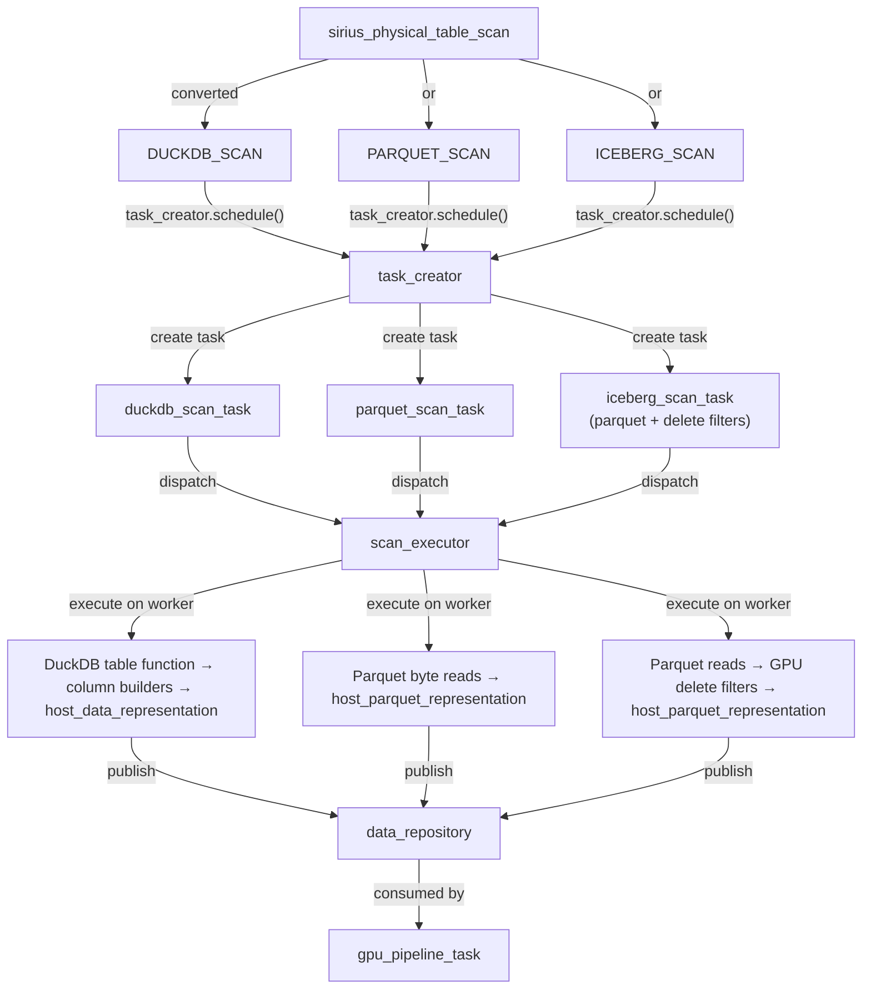

# Scan Subsystem

This document covers the scan subsystem end-to-end: how data enters Super Sirius from storage through two scan paths, the scan executor, caching, and prefetched data sources.

## Overview

Super Sirius supports four scan paths:

| Path | Operator | Use Case | Data Flow |
|------|----------|----------|-----------|
| **DuckDB Scan** | `DUCKDB_SCAN` | General DuckDB-managed tables | DuckDB table function → column builders → `host_data_representation` |
| **Parquet Scan** | `PARQUET_SCAN` | Direct Parquet file reading | Parquet byte ranges → `host_parquet_representation` |
| **Metadata Scan** | `PARQUET_METADATA_SCAN` → `GPU_PARQUET_SCAN` | Two-pipeline Parquet reading | Metadata parsing pipeline → GPU parquet read pipeline |
| **Iceberg Scan** | `ICEBERG_SCAN` | Apache Iceberg V1/V2 tables | Parquet scan + GPU-accelerated delete filters |

All paths funnel data through the same scan executor and data repository infrastructure.

## Scan Operators

### `sirius_physical_table_scan`
**File:** `src/include/op/sirius_physical_table_scan.hpp`

Base scan operator wrapping a DuckDB table function. During pipeline construction (`initialize_internal()`), it is converted to either DUCKDB_SCAN or PARQUET_SCAN based on the table function bind data.

Key members:
- `function` — DuckDB `TableFunction`
- `bind_data` — function binding info
- `column_ids` — which columns to scan
- `projection_ids` — projection optimization
- `table_filters` — predicate pushdown filters
- `scanned_types` — types of scanned columns (constructed from column IDs)

### `sirius_physical_duckdb_scan`
**File:** `src/include/op/sirius_physical_duckdb_scan.hpp`

Sequential scan using DuckDB's execution engine. Tracks an atomic `exhausted` flag. The `scanned_types` vector defines the column types for building output batches.

### `sirius_physical_parquet_scan`
**File:** `src/include/op/sirius_physical_parquet_scan.hpp`

Direct Parquet file scan. Maintains:
- `scanned_ids` — mapping of projection IDs to file column indices
- `has_more_partitions` — atomic flag for pipeline completion
- Row groups are partitioned by `approximate_batch_size` in the global state

### `sirius_physical_iceberg_scan`
**File:** `src/include/op/sirius_physical_iceberg_scan.hpp`

Iceberg table scan. Inherits from `sirius_physical_parquet_scan`. Holds delete file lists (`positional_delete_files`, `equality_delete_files`) and routes through the GPU parquet scan pipeline with a post-convert delete filter hook. See [Iceberg Scan](#iceberg-scan) below.

### `sirius_parquet_metadata_scan_operator` — `PARQUET_METADATA_SCAN`
**File:** `src/include/op/scan/sirius_parquet_metadata_scan_operator.hpp`

First pipeline in the two-pipeline scan architecture. Parses Parquet footers and computes row group partitions. Its `get_next_task_input_data()` atomically advances `_next_file_idx` and returns a `parquet_metadata_input` covering up to 8 files. Its `execute()` reads footers (via `cudf::io::parquet::fetch_footer_to_host()`), attempts AST filter translation using `gpu_expression_translator`, and emits `partitioned_parquet_metadata` containing reader options, file metadata, and row-group partitions.

### `sirius_gpu_parquet_scan_operator` — `GPU_PARQUET_SCAN`
**File:** `src/include/op/scan/sirius_gpu_parquet_scan_operator.hpp`

Second pipeline in the two-pipeline scan architecture. Acts as the sink of Pipeline 1 (accumulating metadata) and the source of Pipeline 2 (serving self-contained `parquet_scan_data` tasks). Each task calls `cudf::io::read_parquet`, applies fallback DuckDB expression filtering if AST translation failed, and prunes pure-filter columns post-filtering.

## DuckDB Scan Task

**File:** `src/op/scan/duckdb_scan_task.cpp`, `src/include/op/scan/duckdb_scan_task.hpp`

### Global State

`duckdb_scan_task_global_state`:
- Manages DuckDB table function global state
- Thread-safe shared state across all scan tasks
- `MaxThreads()` — maximum concurrent scan threads
- `is_source_drained()` — checks if all local states are complete
- Filters are NOT passed to DuckDB (applied by `sirius_physical_table_scan` instead)

### Local State

`duckdb_scan_task_local_state`:
- Maintains per-task state with target batch size (`DEFAULT_SCAN_TASK_BATCH_SIZE`)
- **Column builder** — nested struct managing memory for individual columns:
  - Fixed-width types: data array + validity mask
  - VARCHAR: offset array + data + validity mask
  - Uses `multiple_blocks_allocation_accessor` for writing
  - 8-byte aligned column starts
- Row estimation based on:
  - Actual width of fixed-width types
  - Default VARCHAR width (`DEFAULT_SCAN_TASK_VARCHAR_SIZE`)
  - Per-column validity mask bits (1 bit per row, rounded up)

### Execution Flow

```
1. get_next_chunk() → fetch from DuckDB table function
2. chunk_fits() → check if data fits in pre-allocated buffers
3. process_chunk() → write chunk into column builders
4. Repeat until target batch size reached or source drained
5. Build host_data_representation from column builders
6. If scan incomplete: create next scan task (self-scheduling)
```

## Parquet Scan Task

**File:** `src/op/scan/parquet_scan_task.cpp`, `src/include/op/scan/parquet_scan_task.hpp`

### Global State

`parquet_scan_task_global_state`:
- Reads Parquet footers at construction via `cudf::io::parquet::fetch_footer_to_host()`
- Extracts file paths, sizes, footer offsets from DuckDB `MultiFileBindData`
- Computes compressed/uncompressed byte sizes per row group
- Partitions row groups into scan tasks: groups by accumulated uncompressed bytes where each partition ≈ target batch size
- Atomic counter `_next_rg_partition` for lock-free task scheduling
- Supports rebinding for cache reuse across query re-executions
- Only supports flat schemas (no nested columns)

### Local State

`parquet_scan_task_local_state`:
- Stores file index and row group indices for this task
- Reserves both compressed bytes (for allocation) and uncompressed bytes (metadata)

### Execution Flow

```
1. Construct byte ranges covering:
   - Parquet header (4 bytes PAR1 magic)
   - Column chunk byte ranges for selected row groups
   - Parquet footer + trailer
2. Allocate into chunked host memory
3. Read byte ranges asynchronously via host_read_async()
4. Wait for all read futures
5. Build host_parquet_representation wrapping:
   - Cached allocation, hybrid scan reader, reader options
   - Row group indices, byte ranges, file metadata
6. Optional materialization: if enabled, decompress Parquet → GPU table → host table
7. Wrap in cached_*_representation if caching enabled
```

## Scan Executor

**File:** `src/op/scan/duckdb_scan_executor.cpp`, `src/include/op/scan/duckdb_scan_executor.hpp`

### Thread Model

- **Manager thread**: consumes scan tasks from queue, acquires kiosk tickets, submits to thread pool
- **Worker thread pool** (default: 4 threads): executes scan tasks concurrently
- **CUDA stream pool**: exclusive streams per thread for async Host→Device transfers

### Manager Loop

```
while running:
    1. kiosk.acquire()              -- wait for worker availability
    2. task_queue.pop() or:
       - Try non-blocking pop first
       - If empty: submit scan task request to pipeline executor
       - Then blocking pop
    3. For parquet scans: acquire HOST memory reservation
    4. Dispatch to thread pool:
       a. Acquire CUDA stream
       b. get_scan_output() — applies caching logic
       c. scan_task->publish_output() — store to data repository
       d. Schedule output consumers via task_creator
```

### Cache Handling

`get_scan_output()` applies caching logic based on mode:

| Mode | Behavior |
|------|----------|
| CACHE (first run) | Execute scan, save result to cache |
| PRELOAD (cache hit) | Load from cache, clone if needed |

Cloning logic:
- `TABLE_GPU` cache level: return original (GPU-resident, no copy)
- Other levels: clone batch to avoid sharing cache data
- Parquet: `shallow_clone()` — increments refcount, zero-copy

## Caching Mechanism

**File:** `src/include/op/scan/config.hpp`

Four caching levels control scan result persistence:

### `NONE` (default)
No caching. Full scan on every query. Minimal memory overhead.

### `PARQUET`
Cache raw compressed Parquet bytes in host memory. Stored as `cached_host_parquet_representation`. Decompression happens on each re-execution. Smallest memory footprint for parquet scans.

### `TABLE_HOST`
Cache decoded (decompressed) table in host memory. Stored as `cached_host_data_representation`. Avoids decompression cost on re-execution. Medium memory usage.

### `TABLE_GPU`
Cache decoded table in GPU memory. Fastest — no data movement needed for GPU execution. Highest memory cost.

## Data Representations

### `host_data_representation`
Fixed-width columnar data in host memory. Created directly by `duckdb_scan_task` from DuckDB chunks via column builders.

### `host_parquet_representation`
Raw Parquet bytes in host memory with deferred decompression. Contains:
- `multiple_blocks_allocation` — byte chunks
- `hybrid_scan_reader` — cuDF reader for metadata + decoding
- Byte ranges and row group indices
- File metadata (size, footer offset)

### `cached_shared_representation<T>`
**File:** `src/include/data/cached_data_representation.hpp`

Template wrapper for caching any `idata_representation` type:
- `clone(stream)` — deep copy for unique batches
- `shallow_clone()` — reference-counted copy for cache hits
- `get_representation()` — access underlying shared representation

Specializations:
- `cached_host_parquet_representation = cached_shared_representation<host_parquet_representation>`
- `cached_host_data_representation = cached_shared_representation<host_data_representation>`

## Prefetched Data Source

**File:** `src/op/scan/prefetched_data_source.cpp`, `src/include/op/scan/prefetched_data_source.hpp`

Implements `cudf::io::datasource` interface for cached Parquet data.

### `cache_ranges`
**File:** `src/op/scan/cached_ranges.cpp`

Stores sorted, non-overlapping byte ranges with packed buffers:
- Coalesces adjacent ranges to minimize lookups
- Binary search for `get_ranges(offset, size)` — returns spans covering requested bytes
- Returns `nullopt` if query crosses range boundary (not in cache)
- Supports NUMA-aware hints (`device_id`, `numa_id`) for batch copy optimization

### `host_read()`
Delegates to `cache_ranges::get_ranges()`. If cached, copies spans via memcpy. If not cached, falls back to the original datasource. Tracks `bytes_read_from_cache` vs `bytes_read_from_fallback` atomically.

### `device_read()`
Enqueues async Host→Device copies:

**CUDA 13+ path:**
```cpp
cudaMemcpyBatchAsync()  // Efficient multi-span batched copies
```
Sets `cudaMemcpyAttributes` with NUMA/device locality hints for optimal placement.

**CUDA <13 fallback:**
```cpp
// Per-span cudaMemcpyAsync()
for (auto& span : spans) {
    cudaMemcpyAsync(dst, span.data, span.size, H2D, stream);
}
```

### `device_read_async()`
Uses deferred lambda with CUDA event synchronization:
1. Records `cuda_event_guard` after async copies
2. Returns future that syncs the event on `get()`

## Row Group Pruning
When filter pushdown is enabled and the `gpu_expression_translator` successfully converts DuckDB `TableFilterSet` filters into a cuDF AST, two optimizations activate:

1. **Row group statistics pruning:** During `parquet_scan_task_global_state::initialize_from_files()`, `filter_row_groups_with_stats()` uses Parquet column min/max statistics to discard row groups that cannot match the filter predicate — before any I/O is scheduled.

2. **Reader-level filter pushdown:** The cuDF AST is set on `parquet_reader_options` via `set_filter()`, so cuDF applies the filter inside `read_parquet`. The `TABLE_SCAN` operator is set to passthrough (`passthrough = true`) since filtering is already done by the reader.

If AST translation fails (e.g., unsupported expression types), the `TABLE_SCAN` operator runs the `GpuExpressionExecutor` on the decoded batch as before.

**Filter translation path:** `TableFilterSet` → `convert_table_filters_to_expression()` (skips `OPTIONAL_FILTER` and `IS_NOT_NULL` types) → `gpu_expression_translator` → cuDF AST tree.

## Batch Coalescing
When many small Parquet files each produce a tiny GPU batch, per-task scheduling and kernel launch overhead dominates. Two mechanisms address this:

1. **Accumulation in `get_next_task_input_data()`** (`sirius_physical_table_scan`): Pops batches in a loop until `accumulated_bytes >= scan_task_batch_size` OR `batch_count >= 32`, returning a `pipelineable_operator_data` wrapping the accumulated batches.

2. **GPU concatenation in `execute()`**: When multiple batches are accumulated, calls `cudf::concatenate()` to produce a single fused table before filtering/projecting, reducing kernel launches.

When the parquet scan pipeline applies filter+projection via the cuDF reader (passthrough mode from filter pushdown), `TABLE_SCAN` skips concatenation — only the DuckDB-source code path goes through coalescing.

## Iceberg Scan

**File:** `src/include/op/sirius_physical_iceberg_scan.hpp`, `src/op/scan/iceberg_scan_task.cpp`

`sirius_physical_iceberg_scan` inherits from `sirius_physical_parquet_scan` and adds support for Iceberg V1 and V2 tables.

### Supported Iceberg Features

| Version | Feature | Implementation |
|---------|---------|---------------|
| V1 | Append-only (no deletes) | Identical to plain parquet scan |
| V2 | Positional deletes | `positional_delete_filter`: binary-searches sorted row positions, builds boolean mask, applies `cudf::apply_boolean_mask` |
| V2 | Equality deletes | `equality_delete_filter`: builds `cudf::distinct_hash_join` with delete key rows, probes with data chunk keys, computes anti-join mask on GPU via `thrust::transform` (custom CUDA kernel in `equality_delete_mask.cu`), applies `cudf::apply_boolean_mask` |

### Architecture

- `iceberg_scan_task_global_state` inherits from `parquet_scan_task_global_state`. Its `build_delete_pipeline()` reads delete files via `iceberg_metadata_reader` (lightweight Avro parser for manifest-list and manifest files) and installs a composed `iceberg_delete_pipeline` as a `post_convert_fn_t` hook.
- The `post_convert_fn_t` hook fires after each row-group batch is decompressed to a `cudf::table`, applying all delete filters in-place with zero `cudaMemcpy D2H` in the hot path.
- Equality-delete key columns not in the user's projection are force-projected, then stripped via zero-copy `release()` + truncate after all filters run.
- V3 deletion vectors are not yet implemented but the interface supports adding them.

## Complete Scan Flow



## Key Files

| File | Purpose |
|------|---------|
| `src/op/scan/duckdb_scan_task.cpp` | DuckDB scan implementation |
| `src/include/op/scan/duckdb_scan_task.hpp` | DuckDB scan task, column builders |
| `src/op/scan/parquet_scan_task.cpp` | Parquet scan implementation |
| `src/include/op/scan/parquet_scan_task.hpp` | Parquet scan task, row group partitioning |
| `src/op/scan/duckdb_scan_executor.cpp` | Scan executor manager loop |
| `src/include/op/scan/duckdb_scan_executor.hpp` | Scan executor interface |
| `src/op/scan/prefetched_data_source.cpp` | Cached datasource for cuDF |
| `src/include/op/scan/prefetched_data_source.hpp` | Datasource interface |
| `src/op/scan/cached_ranges.cpp` | Byte range coalescing and lookup |
| `src/include/op/scan/cached_ranges.hpp` | Cache range structure |
| `src/include/op/scan/config.hpp` | Scan config, cache_level enum |
| `src/include/op/scan/sirius_parquet_metadata_scan_operator.hpp` | Metadata scan operator (two-pipeline architecture) |
| `src/include/op/scan/sirius_gpu_parquet_scan_operator.hpp` | GPU parquet scan operator (two-pipeline architecture) |
| `src/include/op/sirius_physical_iceberg_scan.hpp` | Iceberg scan operator |
| `src/include/op/scan/iceberg_scan_task.hpp` | Iceberg scan task with delete filters |
| `src/include/op/scan/iceberg_metadata_reader.hpp` | Iceberg Avro manifest reader |
| `src/op/scan/scan_utils.cpp` | Row group pruning, `build_batch_column_map()` |
| `src/include/data/cached_data_representation.hpp` | Cached data wrappers |
